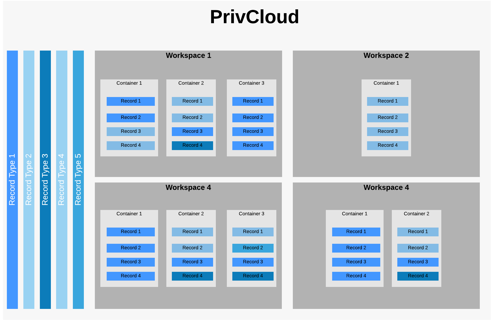

# PrivCloud 
PrivCloud is a secure, high-performing, cloud data-layer for storing sensitive, private information and records. Our platform is designed 
for you to securely store, encrypt, access, process, and grant access to semi-structured sensitive data. We do this by tokenizing your 
data and making it available via our easy-to-use API, very similar to how Stripe manages credit card processing. Once in 
PrivCloud, you decide whether you want your data encrypted with keys that we manage or you can provide your own. We automatically
 rotate keys and follow industry-recognized best practices for both encrypting data and managing keys. We also handle all 
 aspects of security, compliance, and infrastructure management so you can focus on whats important.
 
---
 
## Use Cases
PrivCloud is designed to be flexible an meet the needs of several use cases. Whether you are a CISO trying to retain control 
over sensitive records or a SaaS provider looking to avoid managing PII, credit cards, or healthcare data, PrivCloud can 
help you achieve your goals.

### CISO - Maintaining Control Of Data
As a CISO, your primary objective is to reduce risk and protect critical data. In the age of cloud, businesses rely on 
many third party as-a-service providers and the only way to leverage those providers is to hand them your critical data 
and trust they can properly secure it. PrivCloud provides a centralized, secure, managed data layer where you can grant 
access to exact amount of access you want to third parties while maintaining control over it. All activity in PrivCloud is
 logged so you can see what is happening to your data, when it happened, and who did it. If your third party providers are 
 breached, you can validate that your data was not access rather than taking their word for it. PrivCloud allows you to 
 always maintain control of critical data while still leveraging the massive benefits of cloud.
 
### CISO - Securely Share Redacted Data
Sharing data with third-parties who need access to it for various purposes is a complex task. This is typically an all-or-nothing
scenario and, if "all" isn't acceptable, it is typically a process to extract, transform, redact, package, deliver, and host
redacted data. With PrivCloud, this becomes a simple task that can be done securely, with real-time data, and all access is 
logged. This shortcut will ensure that business continues to operate smoothly, quickly, AND securely. 

### SaaS Provider - Transfer Risk
No matter your size or industry, as a SaaS provider it is a daunting task to secure your customers data. There are so many requirements
 that have to be considered: NIST, ISO27001, PCI, customer contractual requirements, HIPAA, and the list goes on. It requires
 specialized expertise, resources, and investment to ensure data is secure. With PrivCloud, this daunting task becomes
 much easier. The data that you choose can be stored in our secure data layer so that you can focus on your core competency,
 making customers happy, and building your software business. 

### SaaS Provider - Easily Implement BYOK For Your Customers
As a SaaS provider, you are constantly inundated with requests from customers for features and improvements. In the age
 of privacy, the inability to "see" customers data is becoming increasingly important from a liability and customer requirements
 perspective. This can be accomplished by providing your customers the ability to bring their own encryption key to your 
 software. This sounds easy, but if it hasn't been carefully architected into your application it can be a very resource-intensive
 process. PrivCloud's data layer offers a turn-key way to implement BYOK for your customers  to ensure that you can meet
 their security requirements, maintain their trust in you, and continually make them happy customers.
 
 ### SaaS Provider - The Test Data Challenge
 If you are a SaaS provider, you know that testing your software with data that is a close to customer data as possible
 is critical to providing a stable, performant experience for customers. Generating this type of data to either replicate
 customer issues or run test suites with "real-world" data is a very, very complex task involving resources and time. PrivCloud
 makes this process dead simple by giving you the ability to generate data records on the fly using your customer data as a basis.
 This process ensures that the test data is the same size, structure, and complexity of the data you are seeing in production, 
 giving you the confidence that your test suites and bug fixes are great representations of what the software will run like
 in production. 
 

---

## Overview
PrivCloud is architected to be flexible and meet your needs of securing critical data. At the highest level, data can be 
 isolated by workspaces. Within workspaces, you are able to create one or many containers. [Containers](documentation/concepts.md#container) 
 are highly configurable and able to store semi-structured individual records. The structure of these records defined by a 
 [record type](documentation/record-types.md). Containers can only store records of specific record types that you configure. 
 A visual representation of this architecture is below. Granting access to workspaces, containers, and records is all configurable
 through our [permissions system](documentation/permissions.md). You can grant individual [users](#users) or [applications](#applications) 
 through this system. [Workflows](documentation/workflows.md) is event-hook orchestration system that allows you to customize
 and extend PrivCloud and tailor it to your use case and business.

## Details & Examples
You can find details on the [concepts](documentation/concepts.md) page and starter examples in the [examples](examples) directory.

## Contact
We are happy to assist if you have any additional questions about PrivCloud, just email us @ <help@privcloud.com>.
